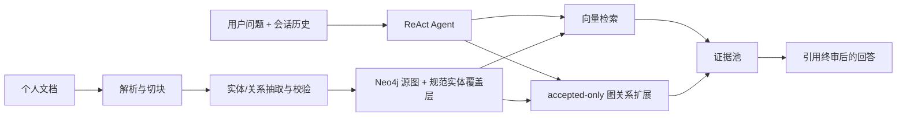

# Archigraph（档图）

Archigraph 是一个面向个人文档的本地优先 **Agentic GraphRAG** 系统。它将 Markdown、文本和 PDF 解析为可追溯的知识图谱，并通过 ReAct Agent 组合向量检索、规范实体关系扩展和多轮对话记忆，生成带原文引用的回答。

项目适合整理技术论文、仓库文档和产品资料，也可作为 FastAPI、Neo4j、Agentic RAG 与 React 全栈实践参考。

## 核心能力

- **文档入库**：解析 Markdown、txt 和文本型 PDF，保留页码、标题路径和字符偏移。
- **知识图谱**：抽取实体与关系，保存 chunk 级证据，并通过 `CanonicalEntity` 处理跨文档实体归一。
- **Agentic RAG**：自研 ReAct 循环使用 `vector_search` 和 `expand_entity` 工具，自主检索、反思和补充证据。
- **可靠引用**：答案角标必须对应真实 Citation；无有效证据时安全拒答，不把无效角标计入置信度。
- **多轮记忆**：历史消息持久化到 Neo4j，追问会先消解指代，再复用同一个独立检索问题。
- **图谱探索**：前端展示 accepted-only 规范图投影、主题社区、有界局部图和来源证据。
- **实时反馈**：RunEvent 通过 SSE 驱动进度时间线和像素 Agent 房间，前端不伪造运行状态。

## 工作方式



源 `Entity / RELATES` 保留文档级事实；跨文档身份通过 `RESOLVES_TO → CanonicalEntity` 表达。图谱视图和 QA 关系扩展在查询时投影 accepted 关系，不额外维护一套容易过期的规范关系。

## 技术栈

| 层             | 技术                                        |
| -------------- | ------------------------------------------- |
| 后端           | Python · FastAPI · Pydantic               |
| 图谱与向量检索 | Neo4j 5 + Vector Index · Docker Compose    |
| LLM            | OpenAI-compatible chat / embedding / rerank |
| Agent          | 自研 ReAct 循环 + function calling          |
| 文档解析       | PyMuPDF · Markdown / txt                   |
| 前端           | React · Vite · TypeScript · Cytoscape.js |

## 快速开始

环境要求：Python 3.11+、Node.js `^20.19.0 || >=22.12.0`、Docker Desktop，以及可用的 OpenAI-compatible 模型服务。

### 1. 配置环境变量

```bash
cp .env.example .env
```

至少配置：

- `OPENAI_BASE_URL`、`OPENAI_API_KEY`
- `CHAT_MODEL`、`EMBEDDING_MODEL`、`EMBEDDING_DIM`
- `NEO4J_PASSWORD`

Chat 模型需要支持 JSON 输出；支持 function calling 时使用 Agentic RAG，不支持时问答会降级到线性 RAG。

### 2. 启动 Neo4j

```bash
docker compose up -d neo4j
```

- Neo4j Browser：http://localhost:7474
- 本地数据目录：`./neo4j/data`

### 3. 启动后端

```bash
cd backend
python -m pip install -r requirements.txt
python -m uvicorn app.main:app --reload --port 8000
```

- API：http://localhost:8000
- OpenAPI：http://localhost:8000/docs
- 依赖检查：http://localhost:8000/health/deps

### 4. 启动前端

```bash
cd frontend
npm install
npm run dev
```

工作台：http://localhost:5173

## 核心 API

| 接口                                                | 用途                                              |
| --------------------------------------------------- | ------------------------------------------------- |
| `POST /api/documents`                             | 上传文档并启动异步入库                            |
| `GET /api/documents`                              | 查询文档列表                                      |
| `POST /api/chat`                                  | 创建问答 Run，返回`runId` 和 `conversationId` |
| `GET /api/runs/{id}/events/stream`                | 订阅 RunEvent SSE 流                              |
| `GET /api/chunks/{id}`                            | 根据 Citation 回查原始 chunk                      |
| `GET /api/graph/canonical/communities`            | 查询规范实体主题社区                              |
| `GET /api/graph/canonical/entities/{id}/subgraph` | 查询有界规范局部图                                |
| `GET /api/graph/canonical/search`                 | 搜索规范实体及 accepted alias                     |
| `GET/POST /api/conversations`                     | 管理多轮会话                                      |

若 `.env` 中设置了 `API_KEY`，非健康检查接口需要 `X-API-Key`。浏览器原生 `EventSource` 不能携带自定义请求头，因此启用 API Key 的部署需要为 SSE 改用 cookie、查询令牌或 fetch-stream 方案。

## 目录结构

```text
backend/    FastAPI、文档解析、图谱写入、实体归一、Agentic RAG、会话与 Run
frontend/   React 工作台、文档库、图谱探索、会话侧边栏和 AgentRoom
evals/      评估标注、脚本和报告
samples/    可公开的样本文档
docs/       架构、评估、工作流和开发记录
neo4j/      本地 Neo4j 数据和日志（不提交）
```

## 质量验证

项目包含后端单元/集成测试、前端 lint/typecheck/Vitest/build、隔离 Neo4j 生命周期测试，以及解析、实体召回、关系可用性、引用命中和幻觉检查等可复现评估。

评估定义与运行方式见 [docs/evaluation.md](docs/evaluation.md)。

## 文档导航

- [项目说明.md](项目说明.md)：架构、数据模型、核心链路和设计取舍
- [backend/后端说明.md](backend/后端说明.md)：后端模块与实现细节
- [frontend/前端说明.md](frontend/前端说明.md)：前端数据流、组件和 AgentRoom
- [docs/evaluation.md](docs/evaluation.md)：评估指标与复现方式
