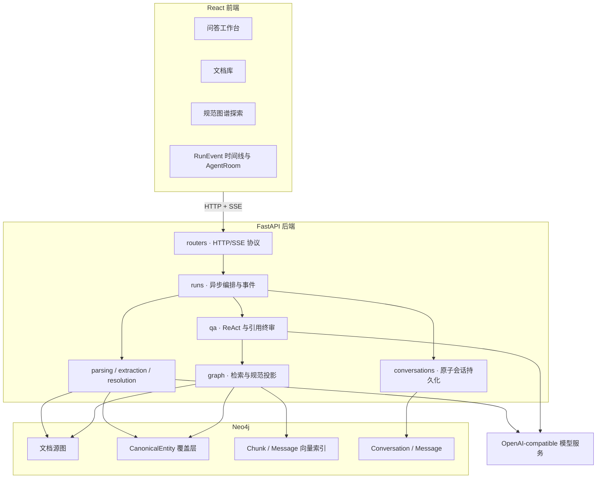
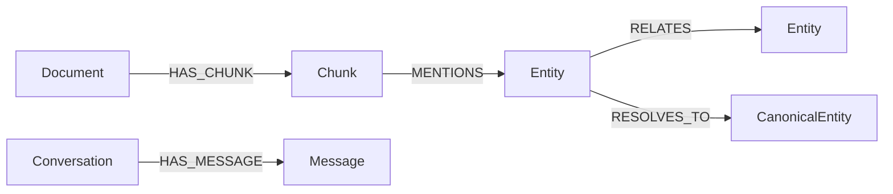

# 项目说明

本文说明 Archigraph 的定位、整体架构、图谱模型、文档入库、Agentic RAG、多轮记忆、事件流、前端交互和关键设计取舍。

- 后端模块细节：[backend/后端说明.md](backend/后端说明.md)
- 前端实现细节：[frontend/前端说明.md](frontend/前端说明.md)
- 评估定义与复现：[docs/evaluation.md](docs/evaluation.md)

## 1. 项目定位

Archigraph（档图）是一个面向个人文档集合的本地优先 Agentic GraphRAG 系统。它将技术论文、仓库文档、产品资料等内容转换为带来源证据的知识图谱，再由 ReAct Agent 组合向量召回和图关系扩展回答问题。

系统关注四件事：

1. **可追溯**：Chunk、实体、关系和回答引用都能回到原始文档位置。
2. **可治理**：LLM 负责提出实体和关系候选，确定性代码负责证据校验、归并、实体解析和降级。
3. **可恢复**：会话及消息持久化到 Neo4j，浏览器刷新或服务重启后仍可读取。
4. **可观察**：文档入库和问答过程产生真实 RunEvent，驱动 SSE、运行轨迹和前端 AgentRoom。

它不是通用工作流平台，也不试图替代企业级搜索系统。项目优先服务个人知识库、学习实践和可复现演示。

## 2. 整体架构



后端按三层组织：

- **协议层**：routers 负责请求校验和响应契约；长任务立即返回 `runId`。
- **编排层**：runs 负责后台任务、阶段事件、终态和 SSE fan-out。
- **领域层**：parsing、extraction、resolution、graph、qa、conversations 实现独立业务逻辑。

LLM 与 Neo4j 调用集中在 clients 和存储模块，领域逻辑通过明确参数和模型交互，便于使用 fake driver 或 mock 模型测试。

## 3. Neo4j 数据模型

Archigraph 在同一 Neo4j 数据库中保存文档事实、规范实体覆盖层和会话记录。



### 3.1 文档源图

| 对象         | 主要内容                                            | 作用                       |
| ------------ | --------------------------------------------------- | -------------------------- |
| `Document` | 文档 ID、名称、来源类型、解析/索引状态、Chunk 数    | 文档级生命周期             |
| `Chunk`    | 原文、embedding、页码、字符偏移、标题路径、内容类型 | 检索与引用的最小证据单元   |
| `Entity`   | 文档内实体 ID、名称、归一名、类型、提及次数         | 保留源文档语境中的实体事实 |
| `MENTIONS` | Chunk 到 Entity                                     | 证明实体在哪段原文中出现   |
| `RELATES`  | source、target、业务类型、置信度、evidence chunk    | 表达带证据的文档内实体关系 |

业务关系统一使用 `:RELATES`，具体类型保存在属性中。这样可以在关系类型尚未稳定时避免堆积大量 Neo4j relationship label。

### 3.2 规范实体覆盖层

不同文档中的 `Entity` 不会被直接改写成一个节点，而是通过覆盖层表达跨文档身份：

```text
(:Entity)-[:RESOLVES_TO]->(:CanonicalEntity)
```

实体解析有三种结果：

- **accepted**：exact、经过验证的 alias 或安全 bootstrap；创建一条带来源证据的 `RESOLVES_TO`。
- **review**：模糊匹配、同名冲突或 alias 歧义；只在源 Entity 上保存候选和原因，不创建 accepted 边。
- **unresolved**：缺少有效 mention 等必要证据；不创建 CanonicalEntity 关系。

`RESOLVES_TO` 记录方法、分数、原因、来源文档和证据 Chunk。Canonical ID 使用确定性规则生成；重复运行、大小写变化和常见标点变化不会产生重复身份。

### 3.3 会话数据

| 对象             | 主要内容                                                               | 作用                       |
| ---------------- | ---------------------------------------------------------------------- | -------------------------- |
| `Conversation` | ID、标题、创建时间、消息计数、turn counter                             | 管理独立对话上下文         |
| `Message`      | 不透明消息 ID、run ID、turn index、角色、正文、引用、置信度、embedding | 恢复历史并支持后续记忆能力 |

消息 ID 根据 `conversation + run + role` 确定性生成；同一 Run 重试不会创建重复消息。

### 3.4 向量索引

系统使用两个 Neo4j cosine Vector Index：

- `Chunk.embedding`：问答的语义召回；
- `Message.embedding`：保存对话向量，为后续语义记忆检索保留基础。

索引维度由 `EMBEDDING_DIM` 决定。后端启动时幂等创建 schema，并校验已有向量索引维度，避免测试或模型切换留下不兼容索引。

## 4. 文档入库链路

`POST /api/documents` 保存上传文件后创建异步 Run，后台执行完整入库：

```text
上传
  → 解析与内容分类
  → 切块并保留位置
  → Chunk embedding 与文档写入
  → 有限并发实体/关系抽取
  → 候选归并与证据门禁
  → 源图写入
  → 跨文档实体解析
  → CanonicalEntity 覆盖层写入
```

### 4.1 解析与切块

支持 Markdown、txt 和文本型 PDF。Chunk 保留：

- `document_id` 和稳定序号；
- 字符区间；
- PDF 页码；
- Markdown 标题路径；
- `content_kind`、语言和 `extraction_policy`。

Markdown 的正文、代码、配置、表格、列表和日志会先由确定性规则分类。配置等不适合抽取的内容可直接跳过，代码类内容使用更保守的抽取策略。扫描版 PDF OCR 不属于核心范围。

### 4.2 向量化与写入

Chunk 文本批量生成 embedding，并以确定性 `chunk_id` 写入 Neo4j。重复导入同一文档时使用 MERGE 更新，不按随机 ID 复制数据。

### 4.3 实体与关系抽取

抽取器对可抽取 Chunk 执行有限并发的 LLM 结构化输出。单个可预期抽取失败会被隔离并记录；意外异常仍终止文档任务，避免悄悄写入不完整结果。

抽取结果进入确定性治理层：

- 实体和关系必须携带真实 Chunk 证据；
- 关系两端必须能解析到同一文档中的实体；
- 关系类型和置信度必须满足门禁；
- 合并结果保持原文顺序和来源；
- 被拒绝的候选进入 diagnostics，而不是静默消失。

### 4.4 实体解析

源图写入后运行确定性实体解析。exact 和有证据的 alias 可以 accepted；模糊候选只进入 review。该过程不会重写源 `Entity / RELATES`，因此原始抽取事实始终可审计。

文档删除会同时清理该文档的 Chunk、源实体和相关覆盖边；只有失去全部来源支持的 CanonicalEntity 才会删除。

## 5. 规范图投影与社区

系统区分三层：

1. **源事实层**：`Entity / MENTIONS / RELATES`，保留文档语境和原始证据。
2. **身份覆盖层**：accepted `RESOLVES_TO / CanonicalEntity`，表达跨文档身份。
3. **查询投影层**：运行查询时临时聚合规范节点和边，不把第二套规范 `RELATES` 写回数据库。

一条源关系只有满足以下条件才进入规范投影：

- 两端源实体都有 accepted resolution；
- 两端 resolution evidence 仍能回到真实 `Document → Chunk → MENTIONS → Entity`；
- relation evidence 属于正确文档，并同时 mention 两端实体；
- 两端不是同一个 CanonicalEntity；
- 通过文档和最低置信度过滤。

规范边按有向 `(source canonical, target canonical, relation type)` 聚合，并返回支持数、置信度和有界来源证据。review、unresolved、跨文档坏证据和自环不会进入正常展示。

图谱 API 在规范投影上提供：

- 确定性、支持度加权的主题社区；
- 以规范实体为中心的有界 BFS 局部图；
- 规范名和 accepted alias 搜索；
- accepted/review/unresolved 和被排除关系的覆盖统计。

这种 read-time projection 让 alias 修正、resolution 变更和文档删除立即生效，不需要维护容易过期的聚合关系。

## 6. Agentic RAG 问答链路

`POST /api/chat` 同步确认会话存在并创建 Run，随后在后台执行问答。

### 6.1 历史指代消解

有历史消息时，系统在受限 LLM 并发区内只执行一次问题改写：

```text
原始追问 + 最近会话历史 → 可独立检索的问题
```

例如“它为什么这样设计？”会被改写成包含明确主体的问题。改写为空、超长或失败时回退原问题。Agentic 和线性降级链路复用同一个改写结果，避免两套检索语义漂移。

历史只用于理解指代和组织回答，不能直接成为 Citation。

### 6.2 ReAct 循环

Agent 使用两个内部工具：

| 工具                         | 行为                                               |
| ---------------------------- | -------------------------------------------------- |
| `vector_search(query)`     | query embedding → Neo4j 向量召回 → rerank        |
| `expand_entity(chunk_ids)` | 从本轮证据 Chunk 出发，读取 accepted-only 规范关系 |

执行过程：

```text
system 指令 + 历史 + 独立检索问题
  → 模型决定是否调用工具
  → 工具结果加入 messages 和 evidence pool
  → 模型反思证据是否足够
  → 必要时换查询或扩展关系
  → 达到终止条件后生成答案
```

`evidence_pool` 按 `chunk_id` 去重。`expand_entity` 只能使用池中已有的 Chunk ID，防止模型凭空扩展任意图谱范围。关系扩展从命中的 accepted CanonicalEntity 出发，聚合有真实来源支持的关系路径，但不会把关系本身伪装成回答 Citation。

循环有硬上限。模型端点不支持 function calling 时，系统使用相同历史和独立问题降级到固定的向量召回、重排、关系扩展和生成流水线。rerank 不可用时再降级为向量分排序。

### 6.3 最终生成

最终生成同时获得：

- 用户原始问题；
- 独立检索问题；
- 最近会话历史；
- 本轮真实证据上下文。

这样既保留用户原意，又能处理指代，同时坚持答案必须由当前检索证据支撑。

## 7. 引用与置信度终审

上下文组装阶段按同一顺序同时生成：

```text
[1] 证据文本 ↔ Citation(index=1)
[2] 证据文本 ↔ Citation(index=2)
```

LLM 生成后，所有 Agentic 和线性答案都进入共享 finalizer：

- 只接受正文中存在且能映射到可用 Citation 的正整数角标；
- Markdown code span、围栏代码和顶层缩进代码中的 `[n]` 不作为引用；
- 无效角标从正文移除；
- Citation 按上下文顺序去重返回；
- 没有任何有效引用时返回固定低置信拒答；
- 混有无效角标时置信度最高为 medium；
- 只有经过终审的 Citation 才能进入 API 和会话历史。

Citation 保存 Chunk、Document、页码/字符区间、标题路径和证据片段。前端点击角标后通过 `GET /api/chunks/{id}` 回查原文。

## 8. 多轮会话记忆

每轮问答读取同一 Conversation 最近的有限窗口，全量消息仍保存在 Neo4j。

回答完成后，系统先批量生成 user/agent 两条消息的 embedding，再通过一个 Neo4j managed write transaction 原子提交完整轮次：

1. 锁定 Conversation 并递增 `turn_counter`；
2. 为 user 和 agent 分配相邻 turn index；
3. 以 `run_id` 检查幂等状态；
4. 一次创建两条 Message 和两条 `HAS_MESSAGE`；
5. 事务失败则整轮不落库，由 Neo4j managed transaction 负责可重试错误。

这保证：

- 并发轮次不会覆盖索引；
- 不会只保存 user 或只保存 agent 的半轮消息；
- 同一 Run 重试不会重复写入；
- 已存在但不完整的 Run 状态不会被静默覆盖。

传入不存在的 `conversationId` 时，chat 路由在创建 Run 之前同步返回 404。Message embedding 当前只存储，不主动做跨会话语义召回；记忆边界仍是同一会话的近期消息。

## 9. RunEvent、SSE 与前端

文档入库、问答和删除都使用统一 Run 模型。路由立即返回 Run ID，后台任务持续追加 RunEvent。

主要阶段包括：

```text
uploading · parsing · extracting · linking · indexing
searching · checking · writing · deleting · rebuilding · error · idle
```

问答工具会映射到真实阶段，例如向量搜索产生 `searching`，规范关系扩展产生 `linking`。前端 `useRunEvents` 消费 SSE，并将同一事件流分别交给：

- RunEventTimeline：展示运行轨迹；
- AgentRoom：根据真实 stage 执行动画；
- 业务页面：在终态刷新文档、图谱或回答。

RunStore 位于后端内存，负责历史回放、订阅队列、终态和 TTL 清理。Run 是瞬态进度信息；文档和对话结果持久化在 Neo4j。后端进程重启后旧 RunEvent 不保留。

浏览器原生 EventSource 不能携带 `X-API-Key` 自定义请求头。本地开发可保持 `API_KEY` 为空；启用鉴权的部署需要为 SSE 使用 cookie、query token 或 fetch-stream。

## 10. 前端工作台

前端包含四个主要区域：

- **WorkbenchView**：多轮问答、Markdown 回答、引用面板和运行轨迹；
- **LibraryView**：上传、查看和删除文档；
- **GraphView**：规范社区、实体搜索、有界局部图和多来源证据；
- **SettingsView**：查看 Neo4j 和模型配置状态。

ConversationSidebar 支持新建、切换、重命名和删除会话。切换会话时，历史消息沿用正常 ChatThread 和 Citation 渲染链路。

AgentRoom 的状态只来自 RunEvent。工作 stage 使用可中断的行为队列，idle 使用本地随机小动作；开启 `prefers-reduced-motion` 时停止位移动画。

## 11. API 概览

| 接口                                                | 说明                     |
| --------------------------------------------------- | ------------------------ |
| `GET /health`                                     | 服务存活检查             |
| `GET /health/deps`                                | Neo4j 与 LLM 配置状态    |
| `POST /api/documents`                             | 上传并异步入库           |
| `GET /api/documents`                              | 文档列表                 |
| `GET /api/documents/{id}`                         | 文档详情                 |
| `DELETE /api/documents/{id}?confirm=true`         | 异步删除文档及相关图数据 |
| `POST /api/chat`                                  | 创建异步问答 Run         |
| `GET /api/chunks/{id}`                            | Citation 回源            |
| `GET /api/runs/{id}`                              | Run 摘要                 |
| `GET /api/runs/{id}/events`                       | RunEvent 历史            |
| `GET /api/runs/{id}/events/stream`                | RunEvent SSE             |
| `GET /api/graph/canonical/communities`            | 规范主题社区与覆盖统计   |
| `GET /api/graph/canonical/entities/{id}/subgraph` | 规范实体局部图           |
| `GET /api/graph/canonical/search`                 | 规范实体搜索             |
| `GET/POST /api/conversations`                     | 会话列表与新建           |
| `GET/PATCH/DELETE /api/conversations/{id}`        | 会话详情、重命名和删除   |

源图实体、邻域、搜索和社区接口继续保留，用于兼容和诊断；主前端图谱体验使用 canonical namespace。

## 12. 配置、存储与安全

模型、Neo4j、上传限制、鉴权和 CORS 全部通过根目录 `.env` 配置，仓库只提交 `.env.example`。

主要配置：

| 配置                                            | 作用                                         |
| ----------------------------------------------- | -------------------------------------------- |
| `OPENAI_BASE_URL / OPENAI_API_KEY`            | embedding 和 rerank 服务，也可作为 chat 回退 |
| `CHAT_BASE_URL / CHAT_API_KEY`                | 可选的独立 chat 服务                         |
| `CHAT_MODEL`                                  | 抽取和 Agent 使用的模型                      |
| `EMBEDDING_MODEL / EMBEDDING_DIM`             | 向量模型及维度                               |
| `RERANK_MODEL`                                | 召回重排模型                                 |
| `NEO4J_URI / NEO4J_USERNAME / NEO4J_PASSWORD` | Neo4j 连接                                   |
| `MAX_UPLOAD_MB / MAX_PDF_PAGES`               | 文档安全上限                                 |
| `API_KEY`                                     | 可选的 HTTP 鉴权                             |
| `CORS_ORIGINS`                                | 允许访问后端的前端来源                       |

Docker Compose 将 Neo4j 数据挂载到当前仓库：

```text
./neo4j/data → /data
./neo4j/logs → /logs
```

这两个目录、真实 `.env`、缓存和私有样本均不进入 Git。删除容器不会自动删除 bind mount 中的数据；需要清空个人知识库时，应先停止 Neo4j，再明确处理 `./neo4j/data`。

API Key 为空时适合本地开发；公开部署应配置鉴权、收紧 CORS，并解决 SSE 鉴权方式。错误响应不返回内部堆栈，文档删除需要显式 `confirm=true`。

## 13. 质量验证

项目的验证分为四层：

1. **确定性单元测试**：解析、归并、问题改写、引用终审、Agent 工具分发、会话事务和规范投影。
2. **隔离 Neo4j 测试**：schema、真实事务、并发轮次、删除生命周期和 read-time projection。
3. **前端验证**：lint、typecheck、Vitest 和 production build。
4. **端到端验证**：真实本地服务、HTTP/SSE、模型问答、临时会话清理和图谱前后指纹。

`evals/` 使用公开样本和 ground truth 评估：

- 文档解析成功率；
- 实体召回率；
- 关系可用率；
- 引用命中率；
- 明显幻觉率；
- 实体/关系 precision 和证据完整度；
- 图谱结构诊断。

真实模型结果具有非确定性，因此模型实测是补充证据，不能代替 fake/mock 驱动的确定性边界测试。

## 14. 关键设计取舍

| 决策                                  | 原因                                                          |
| ------------------------------------- | ------------------------------------------------------------- |
| 自研轻量 ReAct，不引入大型 Agent 框架 | 当前只有单 Agent 和少量内部工具，手写循环更透明、依赖更少     |
| Neo4j 同时保存图谱和向量              | 避免额外向量数据库，向量命中后可直接做图扩展                  |
| 源图与 Canonical 覆盖层分离           | 保留文档语境和可审计来源，不让错误归一破坏原始事实            |
| 规范关系查询时投影                    | resolution 修正和文档删除会即时反映，不维护陈旧聚合边         |
| LLM 产候选，代码做门禁                | 限制脏实体、坏端点和无证据关系进入图谱                        |
| 历史先改写为独立问题                  | 解决“它、这个方法”等指代，同时让 Agentic 和降级检索保持一致 |
| 引用使用统一 finalizer                | Agentic 与线性回答遵守同一引用和 confidence 规则              |
| 会话整轮原子写入                      | 避免并发覆盖、重复消息和半轮持久化                            |
| RunStore 保持内存态                   | Run 只是进度信号；长期业务数据已经写入 Neo4j                  |
| 前端 stage 只读真实 RunEvent          | 动画是系统可观察性的一部分，不制造假进度                      |

## 15. 明确边界

- OCR 不属于核心能力；扫描版 PDF 可能无法提取正文。
- Message 向量已保存，但尚未用于跨会话长期记忆、用户画像或自动摘要。
- ReAct planner 由模型自主决定是否调用工具；模型跳过检索时，引用终审会安全拒答，但不会强制首轮检索。
- RunEvent 不持久化，后端重启后不能恢复旧任务进度。
- 默认部署方式是本地 Docker Compose；公网部署需要额外处理 TLS、持久化备份、鉴权和 SSE token 传递。
- 图谱社区用于导航和降噪，不表示严格的领域分类或因果结论。

## 16. 目录与文档

```text
backend/app/
  parsing/        文档解析、内容分类与切块
  extraction/     LLM 抽取、归并和写入门禁
  resolution/     CanonicalEntity 解析与持久化
  graph/          schema、向量召回和规范投影
  qa/             ReAct、关系扩展、上下文和引用终审
  conversations/  会话模型与原子轮次事务
  runs/           后台任务、状态和事件
  routers/        HTTP 与 SSE 接口

frontend/src/     工作台、文档库、图谱、设置和 AgentRoom
evals/            ground truth、评估脚本与报告
samples/          可公开样本文档
docs/             设计、评估、工作流和开发记录
tasks/            任务与经验记录
```

进一步阅读：

- [README 快速开始](README.md#快速开始)
- [backend/后端说明.md](backend/后端说明.md)
- [frontend/前端说明.md](frontend/前端说明.md)
- [docs/evaluation.md](docs/evaluation.md)
- [docs/audit-workflow.md](docs/audit-workflow.md)
